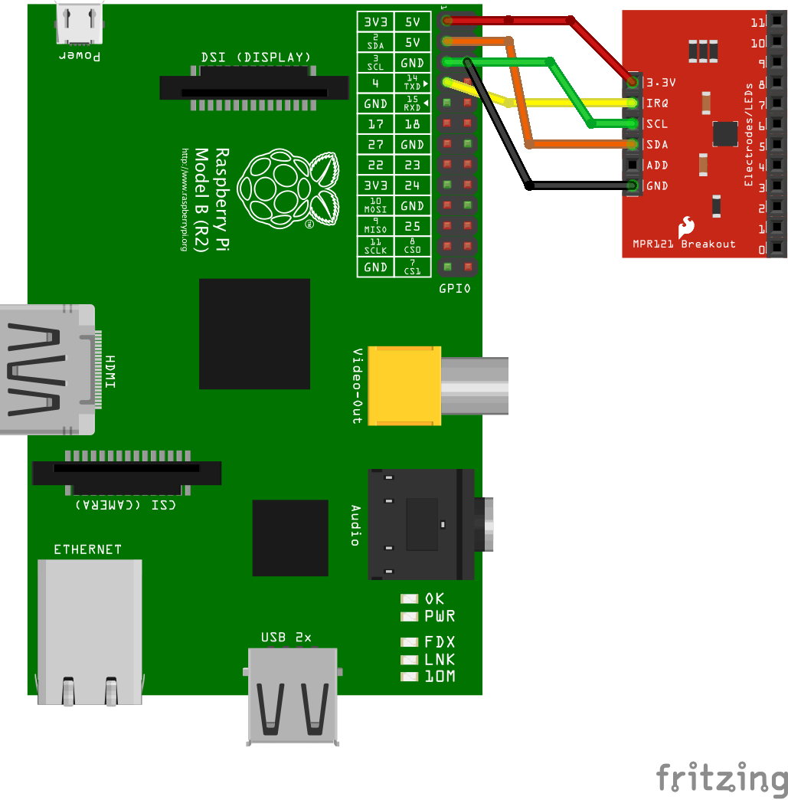

# mpr121.js
Module for interaction between Raspberry Pi and mpr121 on Node.js

##Install
```
npm install mpr121.js
```

##Usage whit interrupt
```javascript
var Mpr121 = require('mpr121.js');

// Address, I2c Bus
var mod = new Mpr121(0x5A, 1);

mod.onTouch = function(pin){
  console.log("Pin" + pin + " was touched");
}

mod.onRelease = function(pin){
  console.log("Pin" + pin + " was released");
}
// Gipio interrupt
mod.startInterrupt(4);
```

##Usage whit polling
```javascript
var Mpr121 = require('mpr121.js');

// Address, I2c Bus
var mod = new Mpr121(0x5A, 1);

mod.onTouch = function(pin){
  console.log("Pin " + pin + " was touched");
}

mod.onRelease = function(pin){
  console.log("Pin " + pin + " was released");
}

mod.onRead = function(values){
  values.forEach(function(element, index, array) {
    console.log("Pin " + index + " value " +element);
  });
}

//polling time in milliseconds
mod.startPolling(200);
```

##Schema

